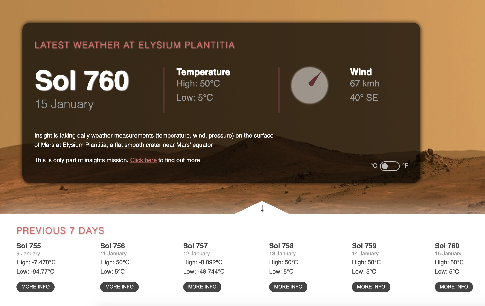

[Abstract](#MarsWeather) | [Concepts](#objective) | [How To Run](#How-To-Run) | [Screenshot](#screenshot) | [Improvements](#improvements)

# MarsWeather

A simple single page app that displays the current, and previous 7 days weather on Mars, as recorded by NASA's [Insight Mars Lander](https://mars.nasa.gov/insight), which has been recording data for almost two years in the Plantitia Elysium plain on the planet.

The data is available through NASA's [Insight API documentation](https://api.nasa.gov/assets/insight/InSight%20Weather%20API%20Documentation.pdf) and gives a number of data points from the surface such as min/max temps, wind speed and direction, atmospheric pressure. There are sometimes gaps in the days data is provided for by the API dude to weather events or other reasons, so in place I have entered dummy data.

The app is currently temporarily hosted at [https://aqueous-plains-40882.herokuapp.com](https://aqueous-plains-40882.herokuapp.com) (may take a few seconds to load)

## Concepts

I created this app as a way to practice creating simple React apps. The concepts that I wanted to cover were

* [React Hooks](https://reactjs.org/docs/hooks-intro.html)
  - UseState
  - UseEffect
* [Functional components](https://reactjs.org/docs/components-and-props.html)
* Passing data between components using props
* Fetching and manipulating data from external APIs
* Using event listeners to dynamically change the page
* CSS styling and animations 

## How To Run

Clone the repo and go to the directory \
`git@github.com:Mnargh/marsweather.git && cd marsweather`

Install dependencies \
`npm i`

Run the App on localhost:3000 \
`npm run start`

## Screenshot

## Improvements

1. Use Redux to store api data and other variables in the state globally as passing these between components limits the complexity and maintainability of the application.

2. Add the ability to select and display info for other days in the main weather display

3. Make the page responsive for different screen sizes, devices

